# EduSystem

A full-stack learning platform with role-based access (User/Tutor/Admin) for creating materials, tests, and tracking progress.

## Development Stack
- **Backend**: C#, ASP.NET Core, Entity Framework, PostgreSQL
- **Frontend**: React, Tailwind CSS, Shadcn UI

## Quick Start with Docker
1. Ensure Docker and Docker Compose are installed
2. Run the application:
   ```bash
   docker compose up --build
   ```
3. Wait for containers to build and start
4. Access the frontend at http://localhost:5173

> **Note**: For local development without Docker, you'll need .NET SDK 9.0, EF Core tools, PostgreSQL, and Node.js.

---

## Getting Started

### 1. Account Registration
- **Users** can take tests and write reviews
- **Tutors** can create materials and tests
- **Admins** can manage users and system content

#### Registration View
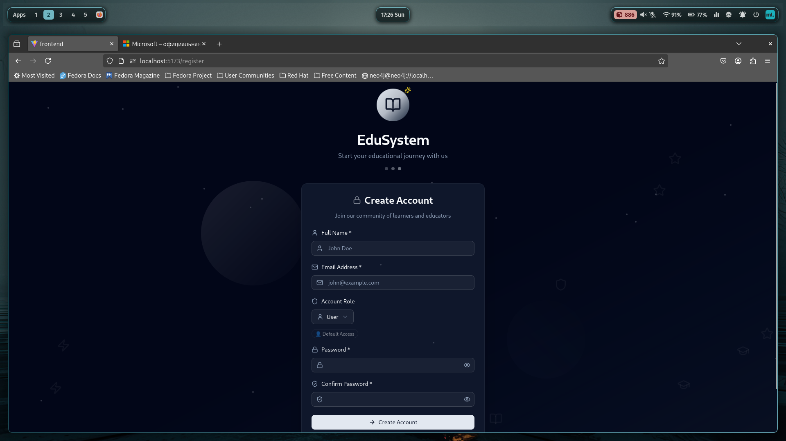
*Select your role during account creation*

#### Login View
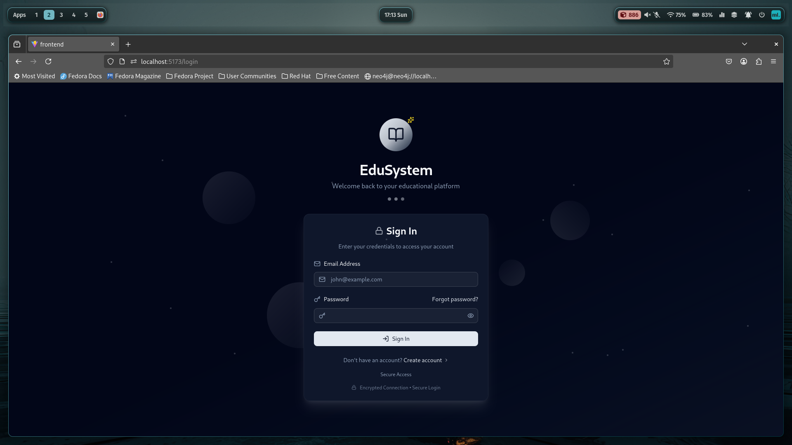

### 2. Dashboard & Navigation
After logging in, you'll see a dashboard with role-specific options.

#### Dashboard Examples
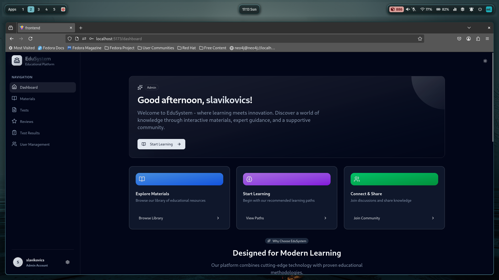
*Default dark theme*

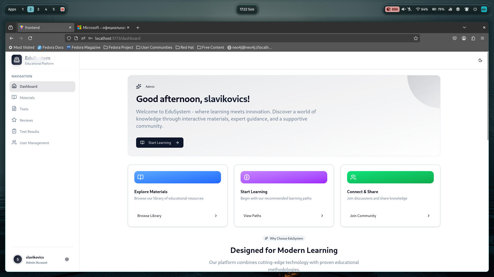
*Switch to light theme if preferred*

---

## Platform Features

### Materials Management
**Available to:** Tutors & Admins
- Create and edit learning materials
  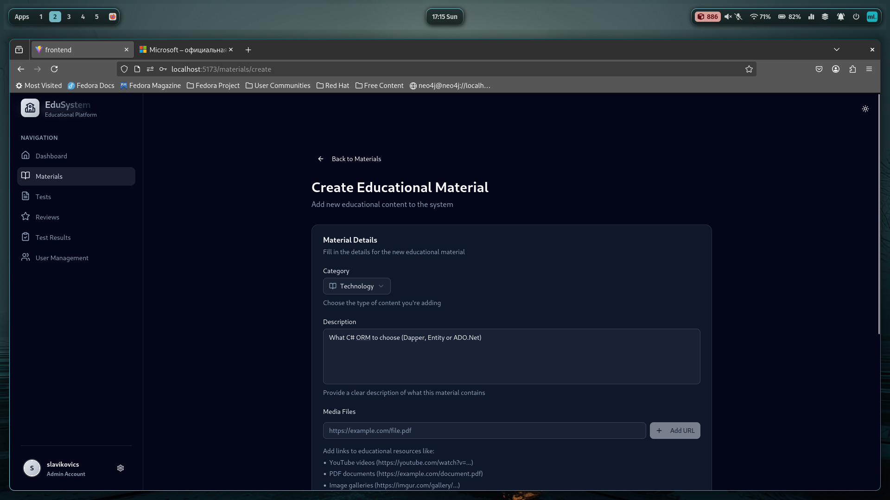
  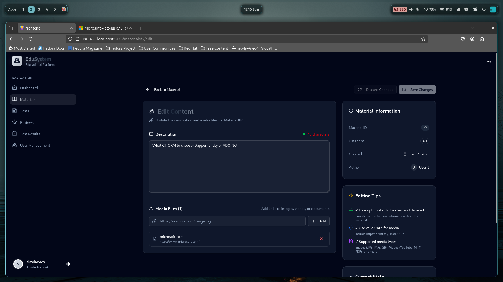

**Available to:** All Users
- Browse all created materials
  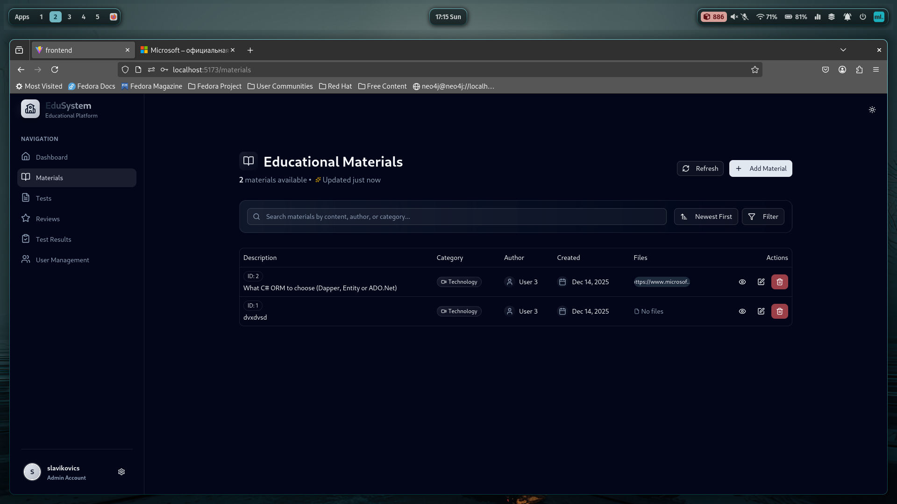

### Tests & Assessment
**Create Tests (Tutors & Admins)**
- Create tests for existing materials
  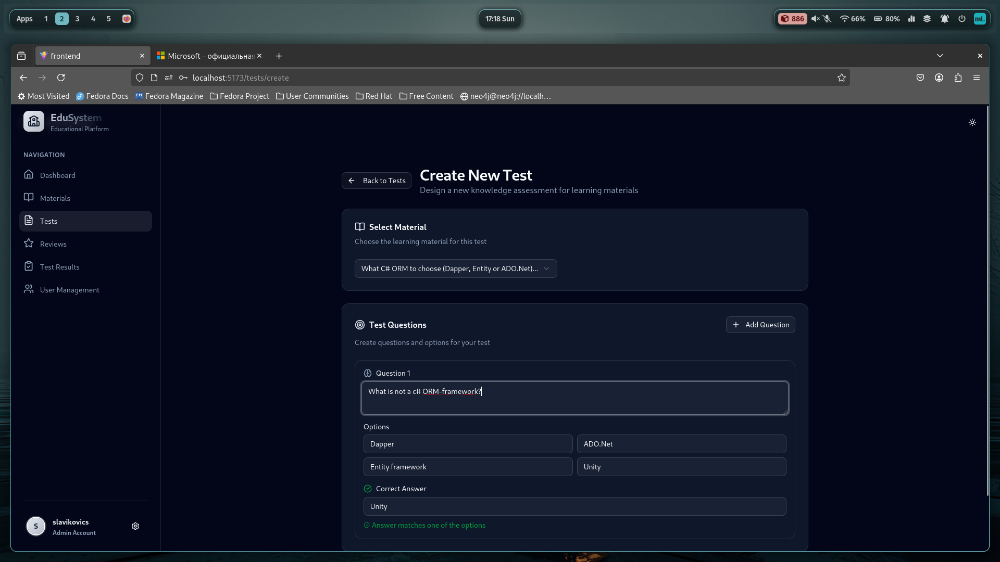

**Browse Tests (All Users)**
- View all available tests
  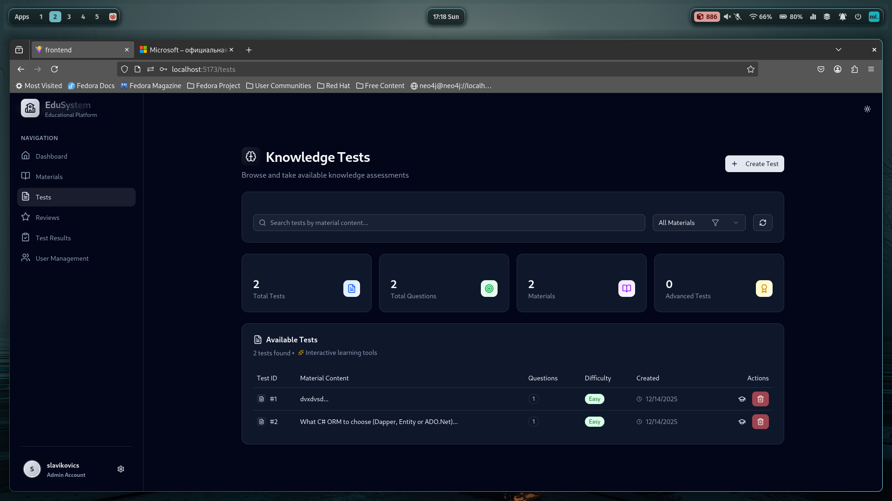

**Take Tests (All Users)**
- Complete assessments
  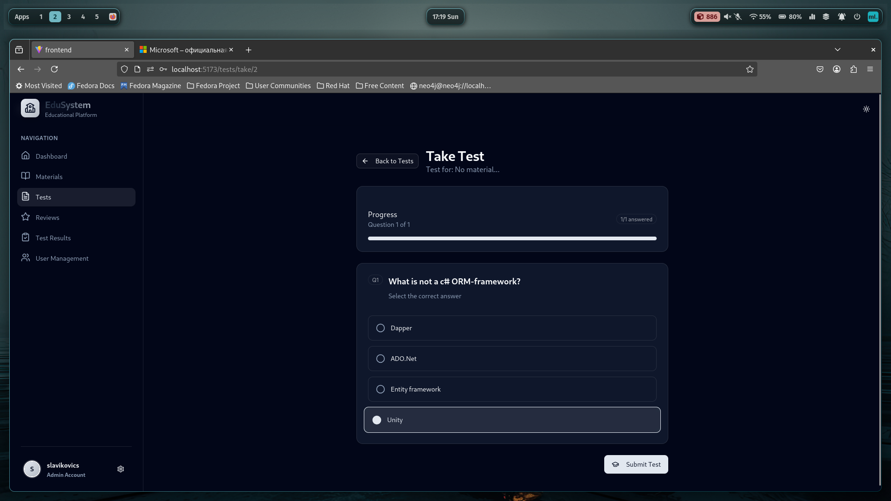
- View results after completion
  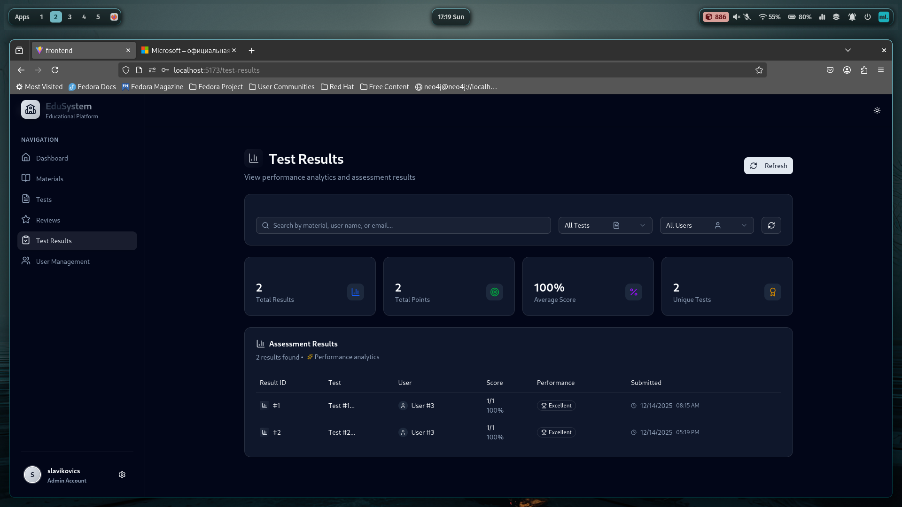

### Community & Management
**Reviews (All Users)**
- Write and read reviews
  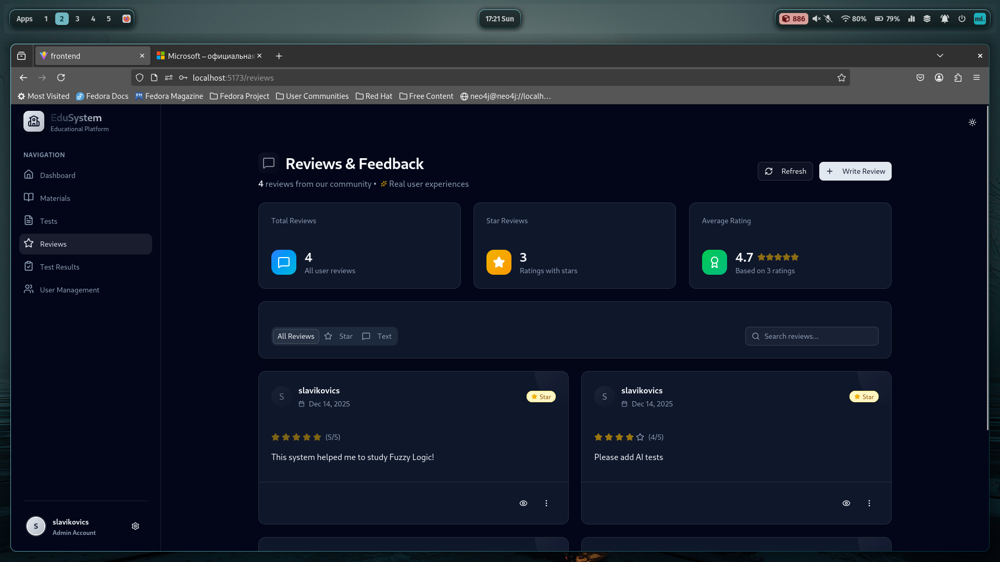

**User Management (Admins Only)**
- Delete or block users
  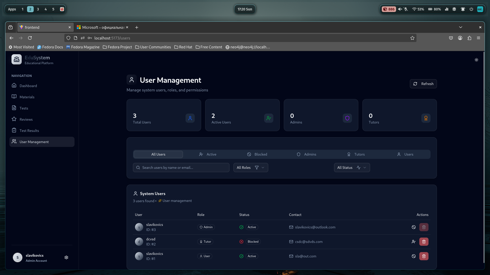

**Profile (All Users)**
- Access personal profile page
  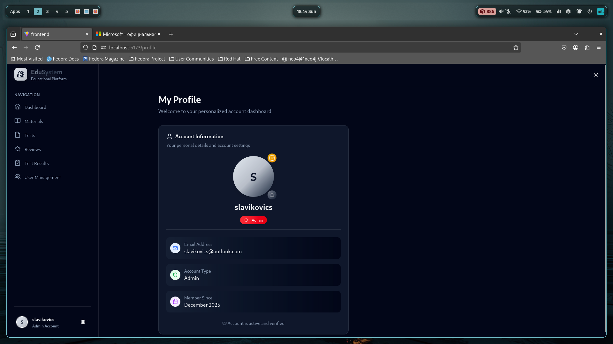

---

## Role Summary
| Role | Materials              | Tests                  | Reviews                | User Management |
|------|------------------------|------------------------|------------------------|-----------------|
| User | View                   | Take & View            | Create & View          | - |
| Tutor | Create & Edit & Delete | Create & Edit & Delete | Create & View          | - |
| Admin | Create & Edit & Delete | Create & Edit & Delete | Create & View & Delete | Full Access |

---